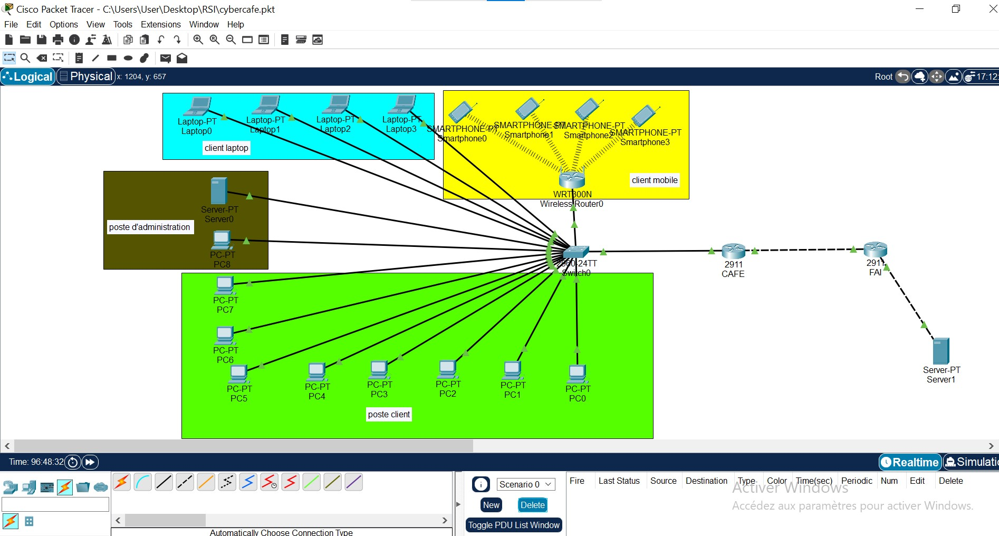

# 🌐 TP : Configuration d'un réseau d'entreprise avec accès Internet et services web

## 📑 Présentation

Dans ce TP, nous avons réalisé la configuration complète d'un réseau d'entreprise pour un cybercafé. L'objectif était de permettre aux postes clients, aux smartphones et aux ordinateurs portables d'accéder à Internet via un routeur FAI. Nous avons également simulé un serveur web et la resolution des noms de domaines.

---

## 🛠️ Architecture Réseau

## 🌐 Configuration des Services

### 🌍 Serveur Web
- Service HTTP activé sur le serveur (IP : 20.20.20.2).
- Création de pages HTML pour simuler l'accès à un site web (ex : `index.html`).
- Accès via l'URL : `http://20.20.20.2` ou `http://www.google.com` (via DNS).

## 🖧 Configuration du NAT

Pour permettre l'accès Internet aux postes clients, nous avons configuré le NAT sur le routeur FAI :

- **Source NAT (SNAT)** : Traduction des adresses IP privées en IP publique.
- **PAT (Port Address Translation)** pour la gestion des connexions multiples.

---

## 🚨 Problèmes rencontrés

- Attribution d'IP incorrecte via DHCP après redémarrage (169.254.x.x).
- Problème de communication entre les sous-réseaux.
- Erreur de résolution DNS lors de l'accès à un site par nom de domaine.

---

## ✅ Solutions apportées

- Redémarrage du service DHCP pour réattribuer les bonnes IP.
- Vérification des routes sur le routeur FAI.
- Configuration correcte du serveur DNS pour la résolution de noms.

---

## 📝 Conclusion

Ce projet nous a permis de maîtriser la configuration d'un réseau d'entreprise avec accès Internet et services web. La gestion des services réseau (HTTP, DNS,) et la mise en place du NAT sont essentielles pour assurer la connectivité et l'accessibilité des ressources internes et externes.

## AUTEUR 
HASSAN IBRAHIM
ibhassan279@gmail.com
